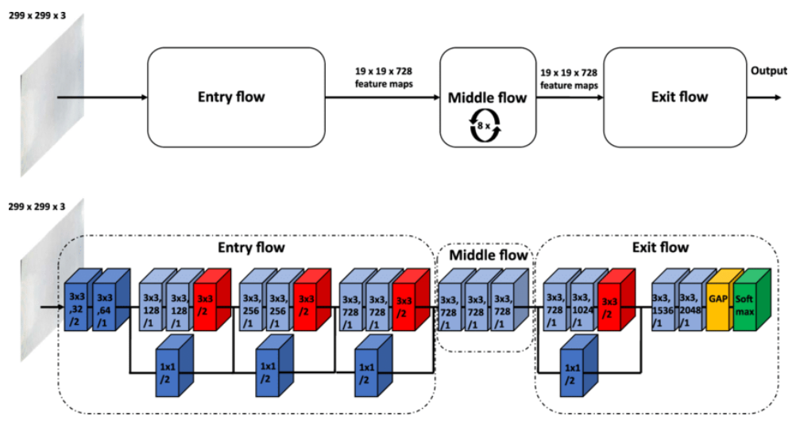
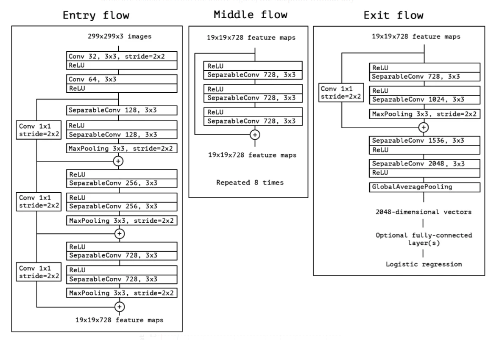

# Xception-Pytorch
 
Customized Xception Model (PyTorch)

This project aims to create a customized image classification model using the Xception architecture as a foundation, incorporating my own modifications.

I used BatchNorm before ReLU because https://github.com/ducha-aiki/caffenet-benchmark/blob/master/batchnorm.md

 

 
